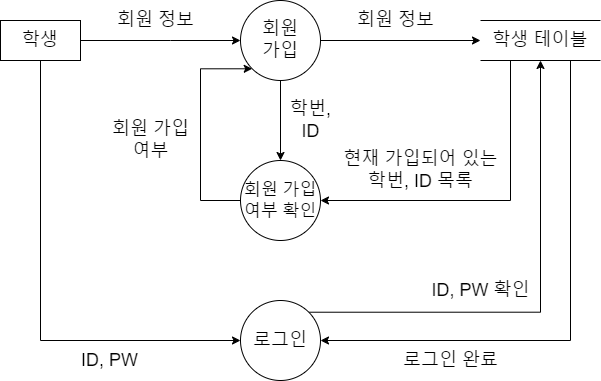

# 대학생을 위한 웹 기반의 Project Management System(PMS) - Database 🗃️

 

## 📖 프로젝트 소개
- **팀 이름 :** CodeCraft
- **프로젝트명 :** 대학생을 위한 웹 기반의 Project Management System(PMS)
- **프로젝트 기간 :** 2024-08-12 ~ 2025-05-27
- **프로젝트 형태 :** [3학년 2학기 ~ 4학년 1학기] 졸업작품 캡스톤 디자인 팀 프로젝트
- **프로젝트 설명**
  - PMS(Project Management System)는 프로젝트를 체계적으로 관리하고 성공적으로 수행할 수 있도록 돕는 소프트웨어를 의미합니다.
  - 본 프로젝트는 기존의 PMS를 벤치마킹하여 대학생에게 필수적인 기능만 추출하고, 여기에서 전공 교과 내용과 최근 떠오르는 AI, 클라우드/가상화 등의 기술을 반영하여 대학생 맞춤형 PMS를 개발하는 것입니다.
  - 본 프로젝트에서는 프로토타입 방법론을 채택하였으며, 1차 프로토타입에서는 기본적인 PMS 기능을 개발하고, 2차 프로토타입에서는 대학생 및 교수를 위한 차별화된 기능을 주로 개발하였습니다.
  - 대학생은 본 PMS를 통해 프로젝트 수행, WBS 및 진척 관리, 각종 산출물 작성 및 관리, 팀원 간의 협업 등을 효율적으로 수행할 수 있습니다.
  - 교수는 교수용 계정을 통해 학생들의 프로젝트와 산출물 등을 확인하고 평가할 수 있습니다.
  - Google Gemini를 활용한 PMS Advisor 기능을 통하여 프로젝트 진행, 산출물 작성 및 관리 등에 대하여 사용자에게 도움 및 조언을 제공합니다.
  - 시중의 PMS와 달리 산출물 Docx 변환 및 다운로드, 사용자별 권한 및 메뉴 접근 제어, 프로젝트 Import/Export 및 버전 관리, 선배 작품 뷰어 기능 등을 제공합니다.

 

## 🗂️ 목차

1. [개발 목표 및 출시 배경](#1--개발-목표-및-출시-배경)
2. [개발 환경](#2-%EF%B8%8F-개발-환경)
3. [사용 기술 스택 및 아키텍처](#3--사용-기술-스택-및-아키텍처)
4. [프로젝트 기간](#4--프로젝트-기간)
5. [개발 중점 사항](#5--개발-중점-사항)
6. [프로젝트 관련 모든 산출물 목록](#6--프로젝트-관련-모든-산출물-목록)
7. [DB 모델링 및 설계, 자료 흐름도(DFD)](#7--db-모델링-및-설계-자료-흐름도dfd)
8. [WBS 및 진척관리](#8--wbs-및-진척관리)
9. [테스트 및 품질관리](#9--테스트-및-품질관리)
10. [협업 및 형상관리](#10-%EF%B8%8F-협업-및-형상관리)
11. [트러블 슈팅](#11--트러블-슈팅)
12. [프로젝트 성과 및 느낀점, 향후 연구 개발 방향](#12--프로젝트-성과-및-느낀점-향후-연구-개발-방향)
13. [PMS 시연 모습](#13--pms-시연-모습)

 

## 1. 💡 개발 목표 및 출시 배경

- **개발 목표 :** 기존의 PMS를 벤치마킹하여 대학생에게 필수적인 기능만 추출하고, 여기에서 전공 교과 내용과 최근 떠오르는 AI, 클라우드/가상화 등의 기술을 반영하여 대학생 맞춤형 PMS를 개발하는 것입니다.
- **초보자를 위한**
  - 프로젝트를 처음 하는 대학생은 어떻게 진행해야 할지 모릅니다. 즉, 프로젝트를 처음 하는 대학생은 어떤 체계로 프로젝트를 진행해야 할지 막연하고, 프로젝트 방법론의 지식이나 진척 관리 등의 방법을 모르는 경우가 많습니다. 그래서, **초보자를 위한 PMS를 만들자**라는 생각을 하게 되었습니다.
- **대학생을 위한**
  - 대학생을 위한 맞춤형 PMS가 없습니다. 시중의 PMS(Trello, Asana, Jira, Notion 등)는 기업 사용자에게 특화되어 있고 대학생이 사용하기에는 부적합하며, 지원되는 산출물 종류가 적고, AI 등의 기술이 적용된 기능과 가이드/도움말이 부족합니다. 그래서, **대학생을 위한 PMS를 만들자**라는 생각을 하게 되었습니다.
- **교수를 위한**
  - 교수가 학생들의 프로젝트를 확인하고 평가하는 기능이 없습니다. 그래서, **교수를 위한 PMS를 만들자**라는 생각을 하게 되었습니다.

 

## 2. 🛠️ 개발 환경

- **Server :** CPU : AMD Ryzen V1500B, RAM : 8GB, Storage : 128GB (VMware ESXi)
- **OS :** Ubuntu 24.04 LTS
- **Container :** Docker, Portainer
- **개발 언어 :** Python, TypeScript
- **라이브러리/프레임워크 :** React, Next.JS, Axios, FastAPI
- **데이터베이스 :** MySQL
- **IDE :** Microsoft Visual Studio Code, Code-Server
- **버전 및 형상 관리 :** GitHub Desktop, VMware Snapshot Backup

 

## 3. 📚 사용 기술 스택 및 아키텍처

- **Server OS :** Ubuntu 24.04 LTS
- **Front-End :** TypeScript, React, Next.JS, Axios
- **Back-End :** Python, FastAPI, Docker, Portainer
- **DataBase :** MySQL, 절차형 SQL(Procedure, Function), 옵티마이저 힌트 및 인덱스
- **LLM(AI) :** Google Gemini 2.0 Flash

<table>
  <tr>
    <td align="center">
       
      시스템 아키텍처 (System Architecture)
    </td>
    <td align="center">
       
      애플리케이션 아키텍처 (Application Architecture)
    </td>
  </tr>
</table>

 

## 4. 📆 프로젝트 기간

- 주제 탐색 및 선정 : 2024-08-12 ~ 2024-10-02
- 프로젝트 계획 : 2024-10-02 ~ 2024-10-21
- 요구사항 분석 : 2024-10-09 ~ 2024-10-21
- 프로젝트 설계 : 2024-10-09 ~ 2024-10-30
- 프로젝트 개발 : 2024-10-13 ~ 2025-04-13
  - 1차 프로토타입 개발 : 2024-10-13 ~ 2024-12-17
  - 2차 프로토타입 개발 : 2024-12-18 ~ 2025-04-13
- 테스트
  - 단위 테스트 : 2025-03-21 ~ 2025-04-10
  - 통합 테스트 : 2025-04-25 ~ 2025-04-27
- 졸업작품 심사 : 2025-04-29
- 논문 작성 및 제출 : 2025-05-09 ~ 2025-05-19
- 졸업작품 전시회 : 2025-05-27

 

## 5. 🎯 개발 중점 사항

- 다음과 같은 전공 교과 내용을 반영하여 프로젝트를 진행하였습니다.
  - 소프트웨어 공학 : 소프트웨어 생명 주기(SDLC) 및 개발 방법론, 자료 흐름도(DFD), 진척 관리, 품질 관리, 형상 관리
  - 데이터 통신, 컴퓨터 네트워크 : 온-프레미스 서버 구축, OSI 7계층, TCP/IP, HTTP/HTTPS, 포트 포워딩, SSH
  - 데이터베이스 : DB 설계 및 데이터 모델링, SQL, 절차형 SQL(Procedure, Function), 옵티마이저 힌트 및 인덱스를 통한 SQL 튜닝
- 다음과 같은 최신 기술을 반영하여 프로젝트를 진행하였습니다.
  - LLM(AI) : Google Gemini 2.0 Flash
  - 가상화 컨테이너 : Docker, Portainer
- 프로젝트를 진행하면서 작성된 계획, 요구사항 분석, 설계, 구현, 테스트 단계의 여러 가지 각종 산출물을 작성하고 관리하도록 하였습니다.
- WBS, 회의록 등을 통해 체계적인 **진척 관리**가 이루어질 수 있도록 하였습니다.
- 단위 테스트와 통합 테스트를 진행하며, 각각 테스트 계획서와 테스트 결과서를 작성하여 **품질 관리**를 진행하였습니다.
- GitHub를 통하여 팀원 간의 협업 및 소스 코드의 버전을 관리하고, 각종 산출물 파일도 디렉토리별로 버전을 관리하여 체계적인 **형상 관리**를 진행하였습니다.
- 개발 과정에서 어려움 또는 오류가 발생할 시 팀원 간 서로 **협력하여 해결**하는 과정을 가질 수 있도록 하였습니다.

 

## 6. 📋 프로젝트 관련 모든 산출물 목록

- 계획
  - 프로젝트 계획서
  - WBS
  - 회의록(주기적으로 작성)
- 요구 분석
  - 요구사항 명세서
  - SOW
  - 메뉴 구성도
  - System Architecture
  - Application Architecture
  - 자료 흐름도(DFD)
- 설계
  - API 설계서
  - 화면/레이아웃(UI) 설계서
  - 산출물 구조 명세서
  - 사용자 권한 세분화 설계서
  - 프로젝트 Import/Export 버전 관리 기능 설계서
  - DB 요구사항 및 업무 분석 명세서
  - ERD
  - DB 도메인 정의서
  - DB 테이블 정의서
  - DB 기능별 함수 정리
- 구현 및 테스트
  - 소스 코드
  - 단위 테스트 계획서
  - 단위 테스트 결과서
  - 통합 테스트 계획서
  - 통합 테스트 결과서

 

## 7. 📃 DB 모델링 및 설계, 자료 흐름도(DFD)

- ### ERD (Entity-Relationship Diagram)
  - DB 요구사항 및 업무 분석 명세서를 바탕으로 개체, 속성, 관계를 도출하여 ERD를 작성하였습니다.

- ### DB 도메인 정의서, 테이블 정의서
  - 컬럼의 데이터 타입, 기본값, 제약 조건 등을 명세한 DB 도메인 정의서를 작성하였습니다.
  - 각 테이블의 컬럼명과 컬럼 설명, 데이터 타입, Null 허용 여부, 키(Key) 등을 명세한 DB 테이블 정의서를 작성하였습니다.

<table>
  <tr>
    <td align="center">
       
      DB 도메인 정의서
    </td>
    <td align="center">
       
      DB 테이블 정의서
    </td>
  </tr>
</table>

- ### 자료 흐름도(DFD)

<table>
  <tr>
    <td align="center">
       
      DFD - 학생 로그인 및 회원가입
    </td>
    <td align="center">
       
      DFD - 프로젝트 관리
    </td>
  </tr>
  <tr>
    <td align="center">
       
      DFD - 진척도 관리
    </td>
    <td align="center">
       
      DFD - 권한 관리
    </td>
  </tr>
  <tr>
    <td align="center">
       
      DFD - 프로젝트 Export
    </td>
    <td align="center">
       
      DFD - 프로젝트 Import
    </td>
  </tr>
  <tr>
    <td align="center" colspan="2">
       
      DFD - PMS Advisor
    </td>
  </tr>
</table>

 

## 8. 📑 WBS 및 진척관리

1. 프로젝트를 시작하기 전에 **프로젝트 계획서**를 작성하였습니다.
2. 이를 바탕으로 **요구사항 명세서**와 **UI 명세서**, **메뉴 구성도** 등을 작성하였습니다.
3. **아키텍처** 등의 각종 설계를 진행하고, 이를 종합하여 **SOW**를 작성하였습니다.
4. 위의 내용을 종합하여 **WBS**에서 계획, 요구사항 분석, 설계, 1차 & 2차 프로토타입 개발, 테스트 및 유지보수, 졸업작품 심사/전시회 준비, 졸업 논문 작성까지의 일정을 수립하였습니다.
5. 매주 1회 이상 주간 회의를 통해 WBS의 Task가 잘 진척되었는지 점검하고, 누락된 사항과 문제는 없었는지 확인하며 **진척 관리**를 진행해 해왔습니다.

 

## 9. 📝 테스트 및 품질관리

- ### 단위 테스트
  - 요구사항 명세서의 내용대로 설계가 되었는지 확인하고 프론트엔드, 백엔드, DB 파트별로 단위 테스트 계획서와 결과서를 작성하여 **품질 관리**를 진행했습니다.
  - 파트별로 단위 테스트를 진행하여 **테스트 케이스** 항목별로 P/NP 여부를 확인하고, 발견된 오류/결함을 어떻게 해결하였는지에 대하여 자세하게 기록하였습니다.

<table>
  <tr>
    <td align="center">
       
      백엔드(API) - 단위 테스트 계획서
    </td>
    <td align="center">
       
      DB - 단위 테스트 계획서
    </td>
  </tr>
  <tr>
    <td align="center">
       
      단위 테스트 결과서
    </td>
    <td align="center">
       
      단위 테스트 결과서 - 결함 조치 내용
    </td>
  </tr>
</table>

- ### 통합 테스트
  - 사용자의 관점에서 PMS의 전반적인 기능을 점검하기 위한 **시나리오 기반**으로 통합 테스트 계획서와 결과서를 작성하여 **품질 관리**를 진행했습니다.
  - 통합 테스트를 진행하여 **테스트 시나리오** 항목별로 P/NP 여부를 확인하고, 발견된 오류/결함을 어떻게 해결하였는지에 대하여 자세하게 기록하였습니다.

<table>
  <tr>
    <td align="center">
       
      통합 테스트 계획서
    </td>
    <td align="center">
       
      통합 테스트 결과서
    </td>
  </tr>
  <tr>
    <td align="center" colspan="2">
       
      통합 테스트 결과서 - 결함 조치 내용
    </td>
  </tr>
</table>

 

## 10. 🗃️ 협업 및 형상관리

- **GitHub를 통한 협업 :** 팀원마다 개발 및 작업한 소스 코드를 GitHub 저장소에서 Pull Request 생성하고, 팀장이 검토 및 승인 후 Merge(병합)하는 방식으로 협업을 진행하였습니다.
- **형상 관리 :**
  - 소스 코드의 버전 관리는 GitHub를 통하여 관리해왔으며, 각종 산출물 파일도 디렉토리별로 버전을 관리하여 체계적인 **형상 관리**를 진행하였습니다.
  - VMware ESXi의 Snapshot Backup 기능을 활용하여 주기적인 **2중 백업**을 진행함으로써, 철저한 백업 체계를 구축하였습니다.

<table>
  <tr>
    <td align="center">
       
      형상 관리 - DB 관련 PR 내역
    </td>
    <td align="center">
       
      형상 관리 - 산출물
    </td>
  </tr>
  <tr>
    <td align="center">
       
      형상 관리 - PR 병합 그래프
    </td>
    <td align="center">
       
      형상 관리 - 스냅샷 2중 백업
    </td>
  </tr>
</table>

 

## 11. 🪛 트러블 슈팅

- **문제 :** PMS Advisor 기능에서 LLM에 제공할 프로젝트의 모든 정보를 어떻게 전달할 것인지에 대한 어려움
  - **고민 :** 처음에는 프로젝트와 진척도, 업무, 각종 산출물 테이블을 모두 조인해서 하나의 결과 테이블을 CSV 파일로 내보내려고 하였지만, 조인되는 테이블이 많아짐에 따라 행의 수가 기하급수적으로 늘어나면서 매우 비효율적이고 LLM에게 전달하기에는 어려움이 있었습니다.
  - **해결 :** 프로젝트 번호를 매개 변수로 받아서 프로젝트와 업무, 진척도, 모든 산출물 테이블을 각각 조회하고 JSON으로 가공하여 반환하는 `fetch_project_for_LLM(pid)` 함수를 직접 정의하여 해결했습니다.

- **문제 :** DB 설계가 이미 완료된 상태에서 PMS의 추가 기능 구현에 필요한 테이블 및 컬럼, 외래키 추가로 인한 DB 구조 변경 문제
  - **해결 :** 개체 간의 관계를 적절하게 파악하고 다른 테이블에는 영향이 적도록 DB 구조를 변경하였습니다. 실제 작업한 사례로는 학과별 교과목 정보를 추가해야 하는 상황에서 학과 테이블과 과목 테이블은 1:N 관계이므로, 학과 번호를 외래키로 설정하여 비식별 관계로 설정하였습니다. 또한, 프로젝트 성적 테이블은 1:1 관계이므로, 프로젝트 번호를 외래키이면서 동시에 기본키로 설정하여 식별 관계로 생성하는 등 개체 간의 관계를 적절하게 파악하여 DB 구조를 변경하였습니다.

- **문제 :** PMS에서 프로젝트 Import/Export 및 버전 관리 기능을 어떻게 구현할 것인지에 대한 어려움
  - **해결 :** MySQL의 CSV 파일을 활용하여 데이터를 내보내고 가져오는 방식을 사용하였습니다. 또한, 프로젝트 버전 정보를 저장하기 위한 별도의 테이블을 생성하고, 이를 통해 사용자가 이전 버전으로 쉽게 롤백할 수 있도록 구현하였습니다.

- **문제 :** Oracle과 달리 MySQL에서 시퀀스 기능 미지원으로 인한 프로젝트별 시퀀스 번호 사용이 불가능한 문제
  - **해결 :** 별도의 시퀀스 테이블을 생성하고, 절차형 SQL의 Procedure와 Function을 활용하여 프로젝트별 시퀀스 기능을 구현하여 해결하였습니다.

- **문제 :** PMS에서 WBS를 조회하는 쿼리의 실행 계획에서 별도의 Using filesort가 발생하는 문제
  - **해결 :** ORDER BY 절에 사용된 컬럼이 인덱스에 포함되지 않아 발생하는 문제이며, 복합 컬럼 인덱스를 생성한 후에 `/*+ INDEX(progress idx_progress_pno_group1to4) */` 옵티마이저 힌트로 해당 인덱스를 적용함으로써 Using filesort를 제거하고 쿼리 성능을 개선하였습니다.

 

## 12. 📊 프로젝트 성과 및 느낀점, 향후 연구 개발 방향

- ### 프로젝트 성과 및 느낀점
  - DB를 처음부터 직접 요구사항 분석, 개념적 및 논리적 모델링을 진행하면서 1:1, 1:N, N:M 관계일 때의 모델링 과정을 직접 경험할 수 있었습니다.
    - 특히, 학생과 프로젝트의 N:M 관계는 별도의 프로젝트 참여 테이블을 생성하고 각 테이블의 기본키를 외래키로 가져오면서 동시에 복합 기본키로 설정하는 것을 통해 N:M 관계를 모델링하는 방법을 배울 수 있었습니다.
  - 인덱스와 옵티마이저 힌트를 활용하여 SQL 튜닝 및 최적화를 진행하면서, 인덱스의 종류와 특징, 옵티마이저 힌트 구문을 통한 쿼리 성능 개선 방법 등을 배울 수 있었습니다.
    - 특히, PMS에서 WBS를 조회하는 쿼리의 실행 계획에서 별도의 Using filesort가 발생하는 문제를 옵티마이저 힌트를 활용하여 인덱스를 적용함으로써 Using filesort를 제거하고 쿼리 성능을 개선하는 경험을 할 수 있었습니다.
  - 웹 기반의 PMS를 개발하면서, 프론트엔드-백엔드-DB 간의 연동 및 통신 과정을 이해하고 경험할 수 있었습니다.
    - 특히, 백엔드와 DB를 연동하는 방법, 외부 인터넷과 백엔드의 Docker 컨테이너 간의 통신을 위한 포트 포워딩, SSH로 DB 콘솔에 접속하는 방법 등을 배울 수 있었습니다.
  - 프로젝트를 진행하면서 개발 작업뿐만이 아니라, 여러 가지의 각종 산출물 작성과 진척 관리, 품질 관리, 형상 관리가 중요하다는 것을 깨달았습니다.
    - WBS는 프로젝트의 전반적인 개발 일정을 관리하는 데 큰 도움이 되었으며, 정기적인 회의를 통해 팀원 간의 진척 사항을 공유하고 피드백을 주고받는 과정이 중요하다는 것을 느꼈습니다.
    - 단위 테스트와 통합 테스트를 진행하면서 품질 관리의 중요성을 깨달았으며, 테스트 계획서와 결과서를 작성하여 발견된 오류/결함을 어떻게 해결하였는지에 대해 자세하게 기록하는 것이 품질 관리에 중요하다는 것을 깨달았습니다. 
    - GitHub를 통한 협업은 팀원 간의 소스 코드 버전 관리 및 형상 관리를 체계적으로 진행하는 데 큰 도움이 되었습니다.

- ### 향후 연구 개발 방향
  - 학교의 서버를 통해 실제로 운영한다면, 우리 학교만의 PMS가 되리라 기대합니다.
  - 공대 계열 학과가 아닌 다른 계열의 학과도 학과 정보, 과목 코드 등을 DB에만 입력하면 바로 사용이 가능합니다. (별도 기능 추가 및 기존의 소스 코드를 수정할 필요가 없습니다.)
  - 사용자에게 불편한 부분, 부족한 기능, UI 개선 등의 피드백을 받으면서 보완한다면, 더 좋은 PMS로 발전할 것입니다.
  - PMS Advisor 기능에서 더 나은 AI 인공지능 답변을 제공할 수 있도록 LLM 튜닝 및 최적화한다면, 더욱 좋은 서비스를 제공할 수 있을 것입니다.
  - 테이블 조인 방식 및 순서 지정 등의 다른 옵티마이저 힌트 구문을 통한 SQL 튜닝 및 최적화를 진행한다면, 조금 더 빠르고 가용성이 높은 PMS를 지속적으로 운영할 수 있을 것입니다.

 

## 13. 📸 PMS 시연 모습

> [!NOTE]
> 시연 영상은 우측의 링크를 참고 부탁드립니다. [PMS 시연 영상 링크](https://drive.google.com/file/d/1EX5CQirzzBTYXT9yO5r9rl2X6v1Z7uuN/view?usp=sharing)
